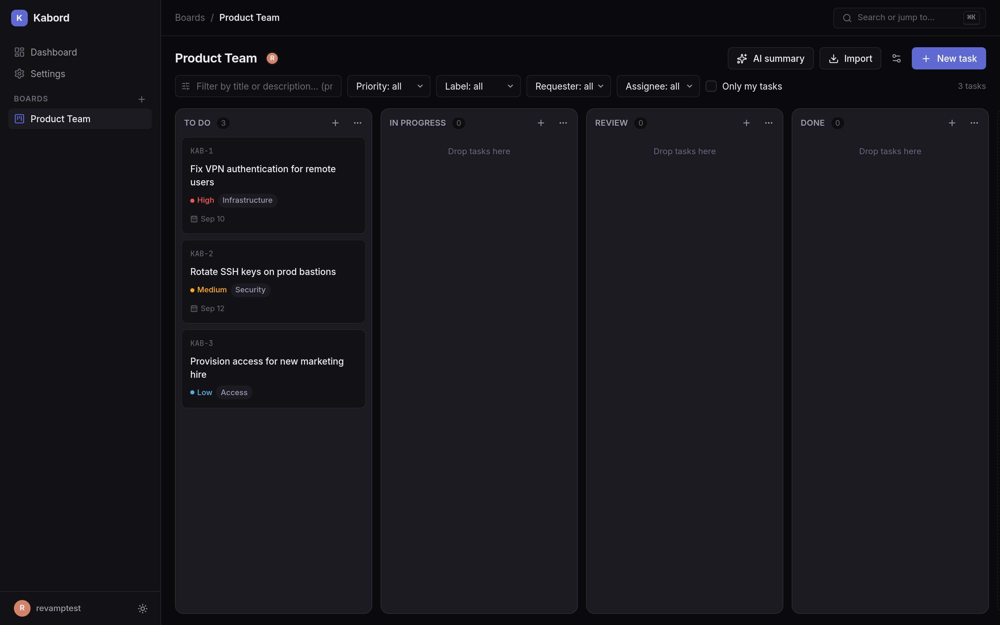
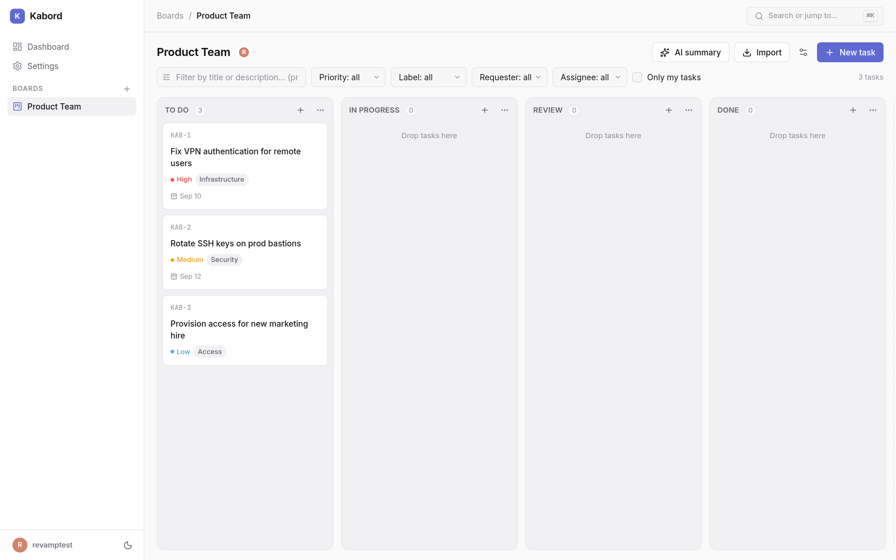
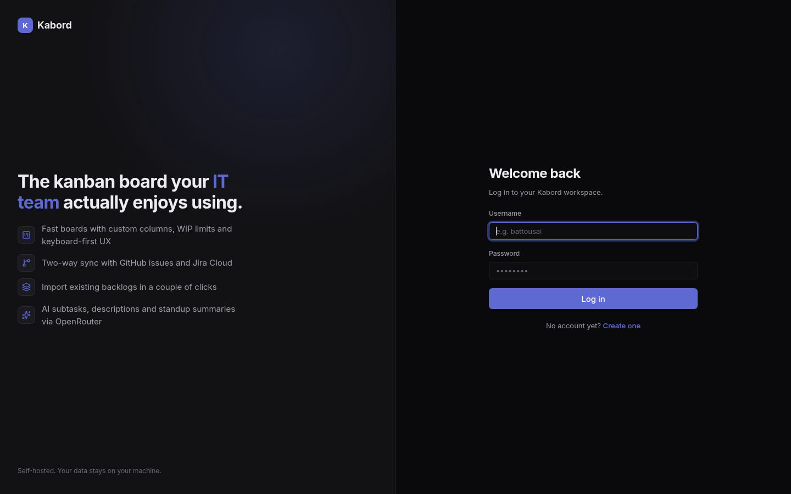
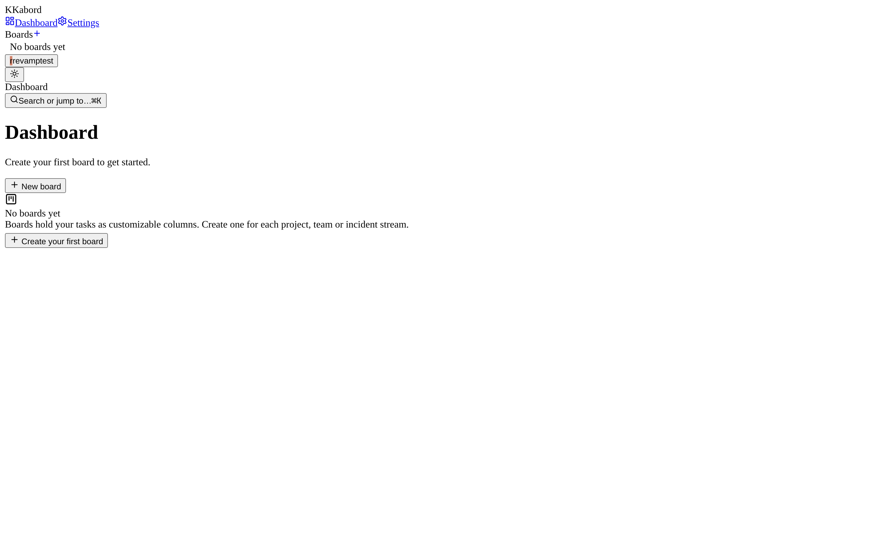
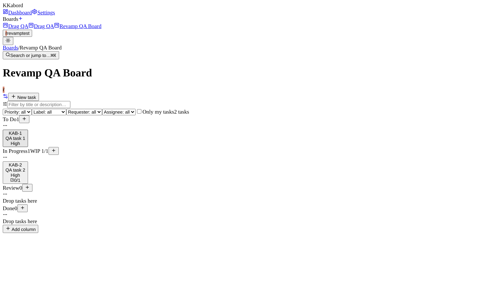
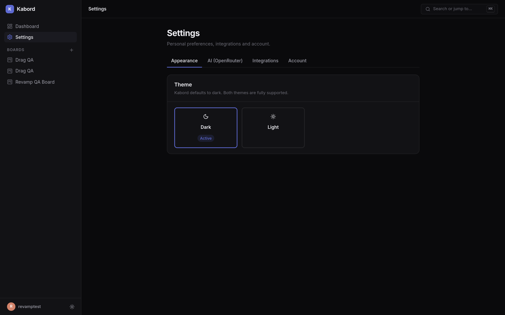

<div align="center">

# 🗂️ Kabord

**Professional, self-hosted kanban for IT teams — with GitHub, Jira & AI superpowers.**

Dark-first Linear-style design · Keyboard-first UX · Your data stays on your machine

[](./LICENSE)
[](https://nextjs.org)
[](https://www.typescriptlang.org)
[](https://github.com/WiseLibs/better-sqlite3)

</div>

---



## ✨ Features

### Board
- 🎯 **Multi-board workspace** with a persistent sidebar and breadcrumbs
- 📊 **Custom columns** — add, rename, reorder, delete, mark as completion column
- 🚦 **WIP limits** per column with live counters and over-limit warnings
- 🖱️ **True drag & drop** ([@dnd-kit](https://dndkit.com)) — mouse *and* keyboard; card order persists (dense positions)
- 🔢 **`KAB-n` task numbering** per board, priority, labels, assignees, requesters, due dates

### Task detail (peek panel)
- ✏️ Inline editing, **subtasks** with progress, **comments**, full **activity history**
- 🔗 **Linked issues** — badges that jump straight to the GitHub issue or Jira ticket

### Integrations (bring your own keys)
- 🐙 **GitHub** — import issues into any column, push tasks as new issues
- 🟦 **Jira Cloud** — JQL search import, push tasks (with proper ADF descriptions)
- 🔐 All credentials are **AES-256-GCM encrypted at rest** and never returned to the browser — only masked hints like `sk-or-…4f2a`
- ✅ One-click **Test connection** per provider

### AI (via OpenRouter)
- 🪄 **Subtask generator** — review chips, add what you want
- ✍️ **Description writer** — Context / Requirements / Acceptance criteria
- 💡 **Priority & label suggestions** — constrained to your board's labels
- 📋 **Standup summary** — board-level summary with wins & risks, referencing `KAB-n`
- 🤖 Model configurable (default `openai/gpt-4o-mini`; curated + free models in the picker)

### UX & theming
- 🌙 **Dark (default) + light theme**, persisted per user, no flash on load
- ⌨️ **Command palette** `Ctrl/Cmd+K` — fuzzy search tasks, jump to boards, run commands
- ⌨️ Hotkeys: `N` new task · `/` focus filter · `Esc` close
- 🔔 Toasts, skeletons, empty states everywhere

### Security
- Signed session cookies (HMAC-SHA256, uid-only payload)
- Per-route authorization (board membership / owner checks on everything sensitive)
- CSRF origin checks, rate limiting (login / AI / integrations)
- Foreign keys ON + transactional cascades — no orphaned rows

## 🌤️ Light theme



## 🚀 Quick start

```bash
git clone https://github.com/AlifrahmanPutranda/kabord.git
cd kabord
npm install
npm run dev        # → http://localhost:3000
```

> Requires **Node 22** (pinned via [`mise.toml`](./mise.toml) — `better-sqlite3` prebuilds).
> A seeded `admin` user exists; set `ADMIN_DEFAULT_PASSWORD` before first boot or just register your own account at `/register`.

### Environment

| Variable | Purpose | Default |
|---|---|---|
| `KABORD_SECRET` | 64-hex master key for session signing + token encryption | auto-generated `.kabord.key` (gitignored, `0600`) |
| `ADMIN_DEFAULT_PASSWORD` | password for the seeded `admin` user | random (lost if unset) |

Set `KABORD_SECRET` in production so sessions survive redeploys.

## 🔌 Setting up integrations

Everything is configured in **Settings** inside the app — no env vars for tokens:

| Provider | What you need | Where to get it |
|---|---|---|
| **GitHub** | Personal Access Token (`repo` scope, or fine-grained with issues read/write) | github.com/settings/tokens |
| **Jira Cloud** | Atlassian email + site domain + API token | id.atlassian.com/manage-profile/security/api-tokens |
| **OpenRouter** | API key | openrouter.ai/keys |

Then use **Import** on any board (pick repo/project → preview issues → select → import) and **Push to…** in a task's panel.

## ⌨️ Keyboard shortcuts

| Key | Action |
|---|---|
| `Ctrl/Cmd + K` | Command palette |
| `N` | New task |
| `/` | Focus filter |
| `Esc` | Close panel / palette |
| `Space` → arrows → `Space` | Keyboard drag & drop on cards |

## 🏗️ Architecture

```
app/
  (auth)/            login & register (standalone)
  (app)/             app shell — sidebar + topbar
    dashboard/       board grid, invitations
    board/[id]/      BoardView: dnd-kit columns, task panel, import, AI actions
    board/[id]/settings/  columns, labels, requesters, members, danger zone
    settings/        appearance, AI, integrations, account
  api/               route handlers — all guarded via lib/api-auth (withApi)
  styles/            design tokens + per-component CSS (kb-* BEM, [data-theme])
lib/
  db.ts              better-sqlite3 singleton (WAL, FK on) + user_version migrations
  session.ts         HMAC-signed cookie sessions
  crypto.ts          HKDF subkeys, AES-256-GCM token encryption
  columns.ts · subtasks.ts · comments.ts · links.ts · tasks.ts · boards.ts
  integrations/      store.ts (encrypted configs), github.ts, jira.ts, openrouter.ts
  ai.ts              OpenRouter prompts (JSON mode + tolerant extraction + retry)
components/
  shell/             AppShell, Sidebar, Topbar
  ui/                primitives + CommandPalette
  providers/         Theme, Toast, Palette
```

**Migrations** are versioned in [`lib/migrations.ts`](./lib/migrations.ts) and applied automatically on first DB access — back up `kabord.db` before upgrading.

## 📸 More screenshots

| Login | Dashboard | Task panel | Settings |
|---|---|---|---|
|  |  |  |  |

## 📄 License & attribution

This project is released under the **MIT License with a mandatory attribution addendum** — see [LICENSE](./LICENSE).

> ✳️ Any use, fork, redistribution or publication of this software **must retain visible attribution** to the original author: **Alifrahman Putranda** ([github.com/AlifrahmanPutranda/kabord](https://github.com/AlifrahmanPutranda/kabord)). This requirement may not be removed.

---

<div align="center">
<sub>Built with ❤️ by <a href="https://github.com/AlifrahmanPutranda">Alifrahman Putranda</a></sub>
</div>
